### Francisco Javier Rojas
### Juan Camilo Rojas

---

# LAB 6

---

## Integración contínua con CircleCI y Heroku

Usando la siguiente documentacion:
[Documentación CircleCI para Heroku:](https://circleci.com/integrations/heroku/)

Para este ejercicio haga uso de la versión funcional de su aplicación: la rama 'master' con la aplicación basada en un 'mock' de la lógica, o la versión completa (en caso de que ya la tenga) ya mezclada en la rama 'master'.

### Parte II.

1.2.3 NoS autenticamos y creamos el proyecto, luego vinculamos el repo de github y finalmente regenramos la key api
    
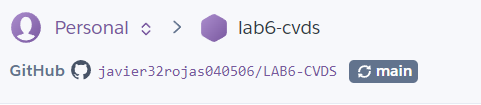 

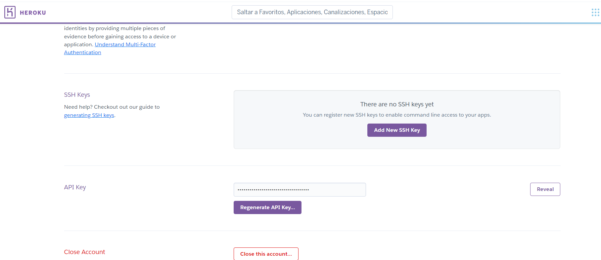

4. Realizamos la integracion con CIRCLE CI  y agregamos la siguinete llaves o variables de entorno

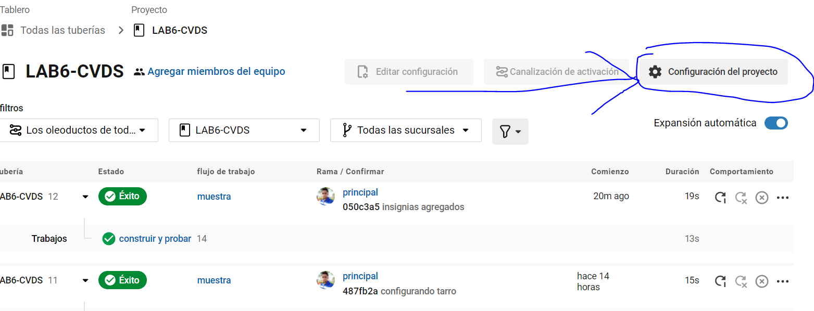
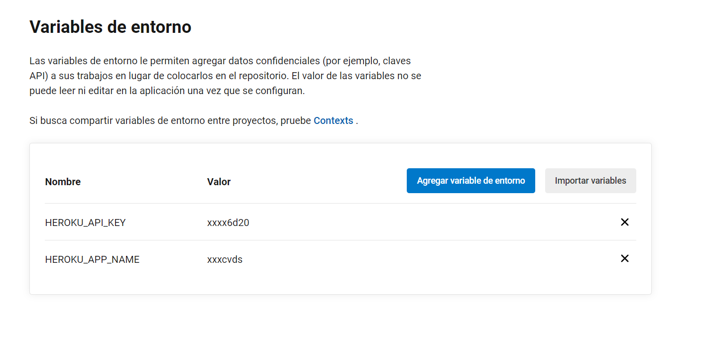  

   (nota: es importante usar esos nombre como variable)
   (des: en la variable name va el nombre del proyecto en HEROKU
        Y  en la variable API KEY la llave que se genero en HEROKU)
   

5.6 Agregamos el archivo /.circle/config.yml este puede ser copiado de la web
de circle CI (OPCION TRES PUNTOS A LADO DEL PROYECTO >>> ARCHIVO DE CONFIGURACION)

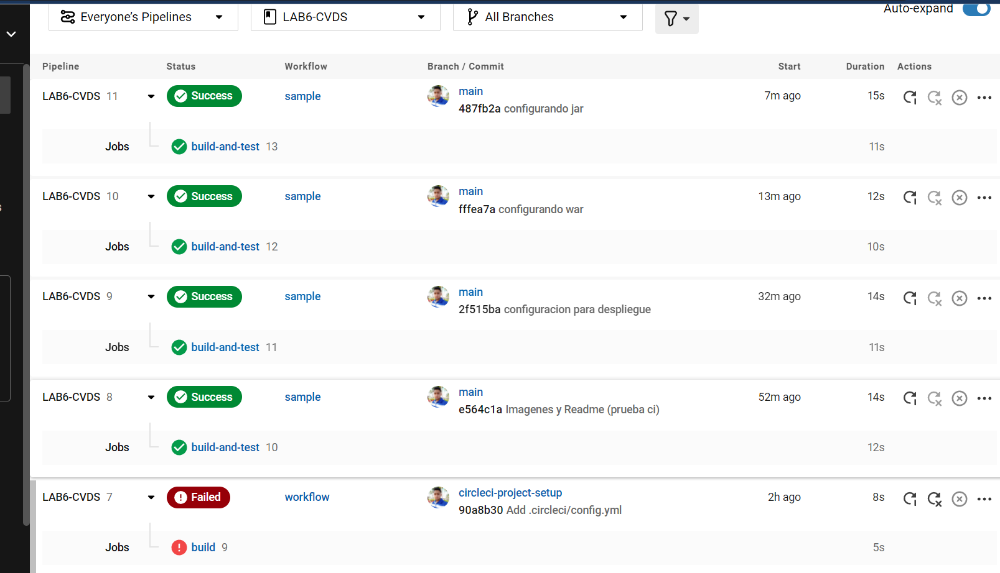
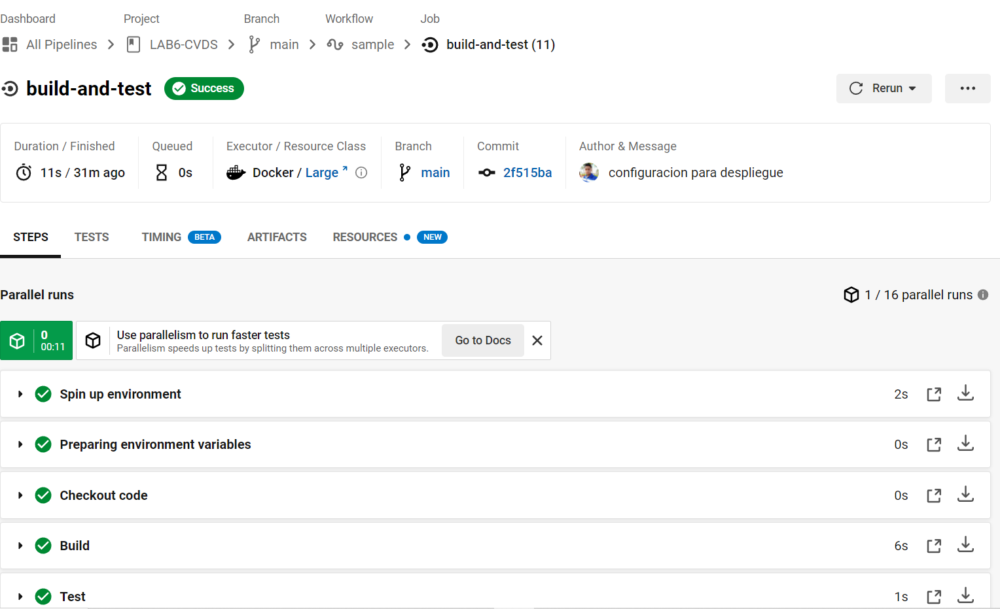

7.8.9 archivos necesarios para deploy

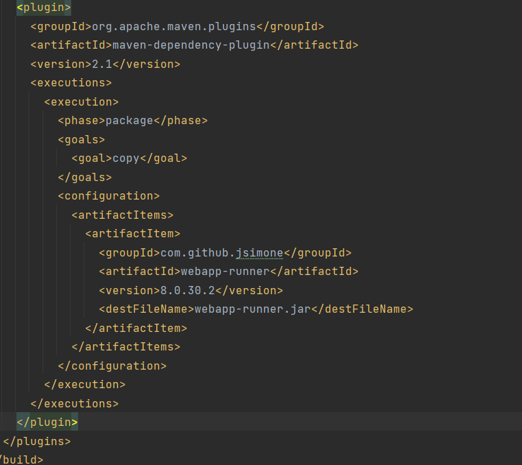
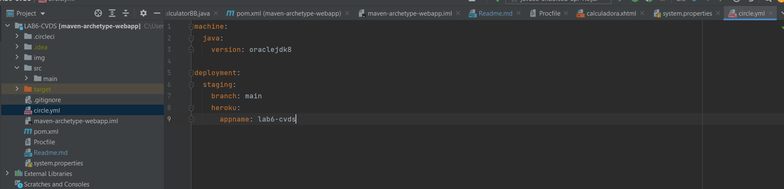
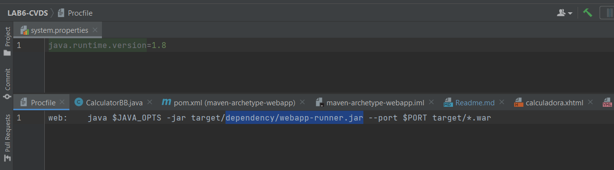

10. Deploy
    
    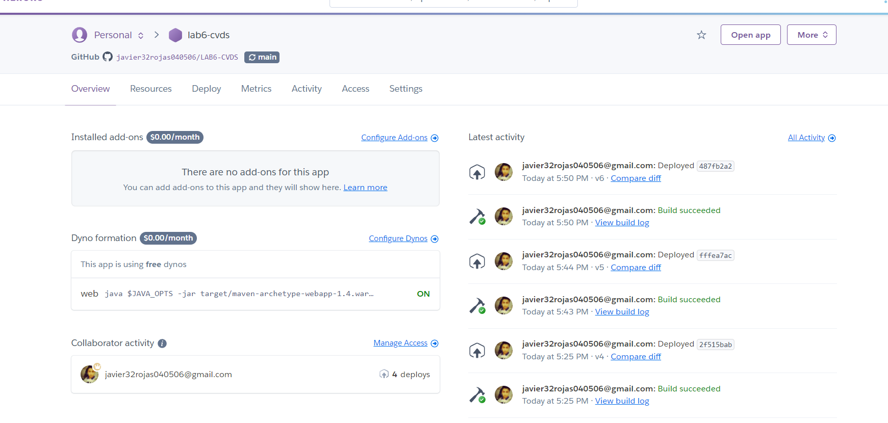
    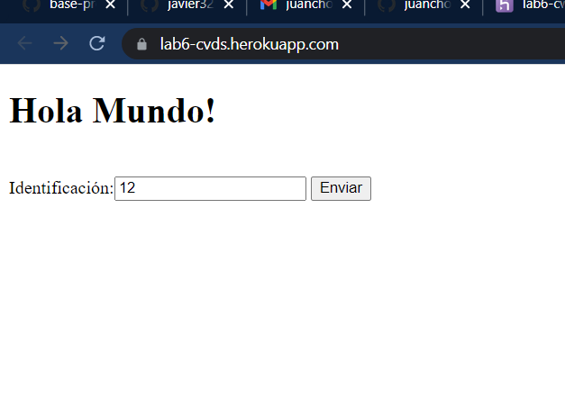
    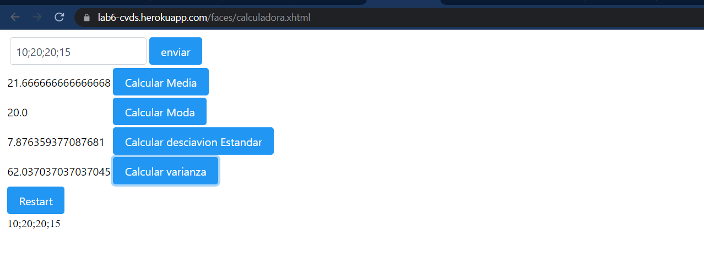
    
11. Codacy
    
    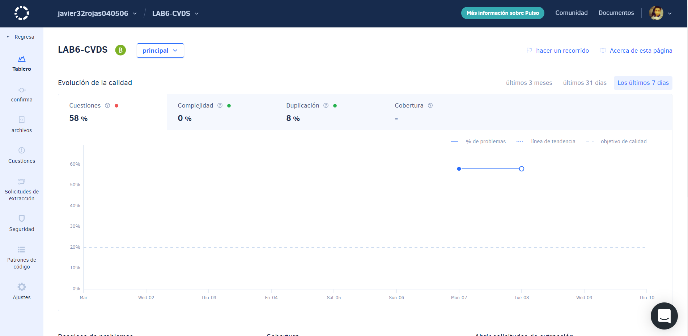
    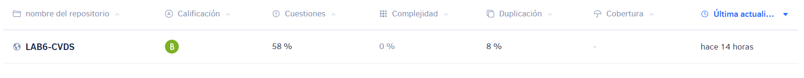
    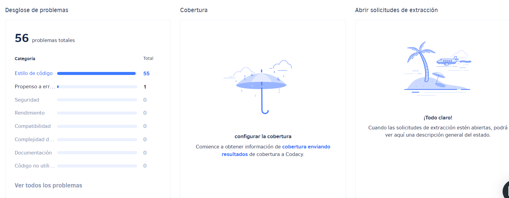
    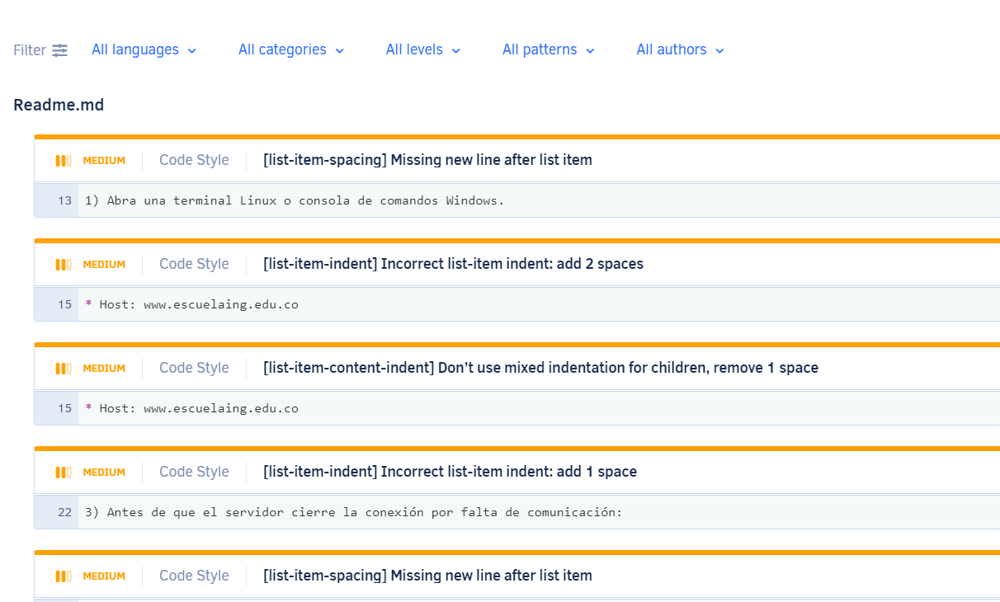
    
12. badges
    
    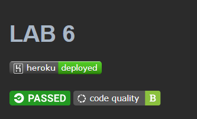